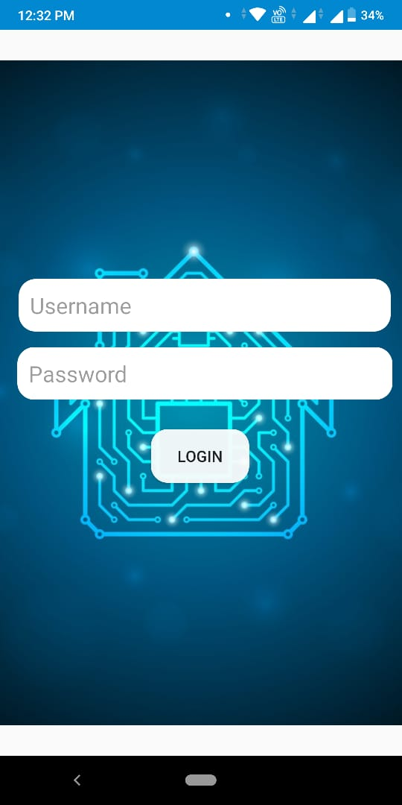
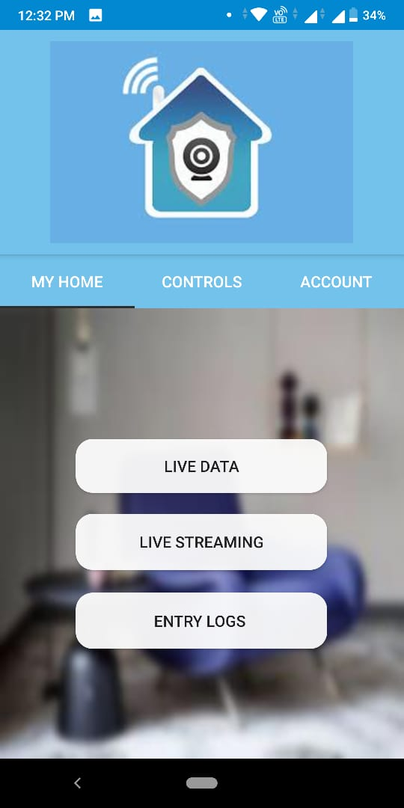
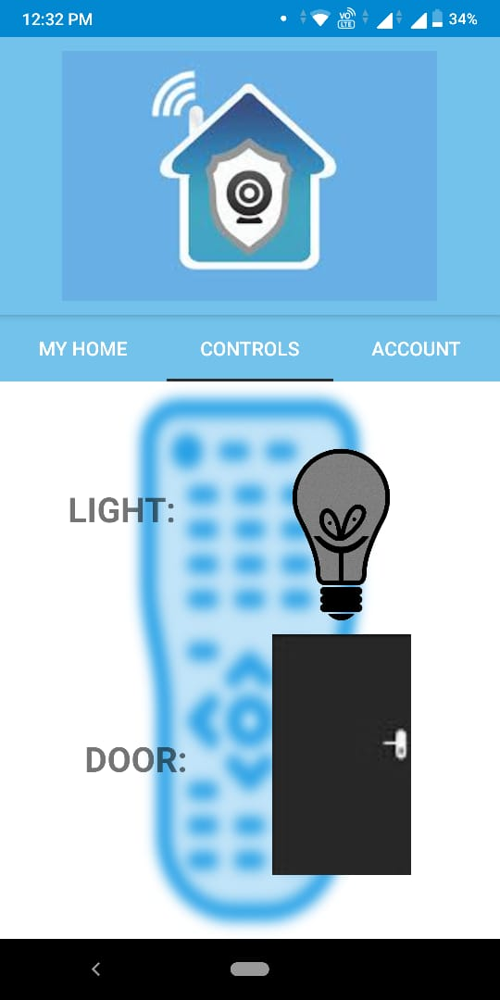
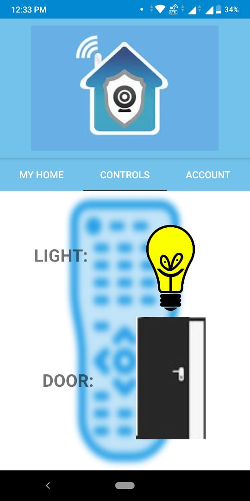
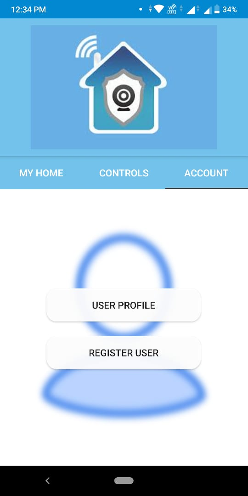

# SmartHomeSecurityApp
It is the android part of Smart Home Security System!!

It is a cloud-based Android Application to implement various home security solutions like movement alert, remote locking and unlocking of doors, remote access of electrical appliances, live video streaming etc. This application collects data from various sensors like PIR, DHT11 and MQ2 to generate alerts.

Appilication screen shots-

LOGIN PAGE

app is divided into three fragments

1.MY HOME FRAGMENT

2.CONTROLLS FRAGMENT

3.ACCOUNT FRAGMENT

